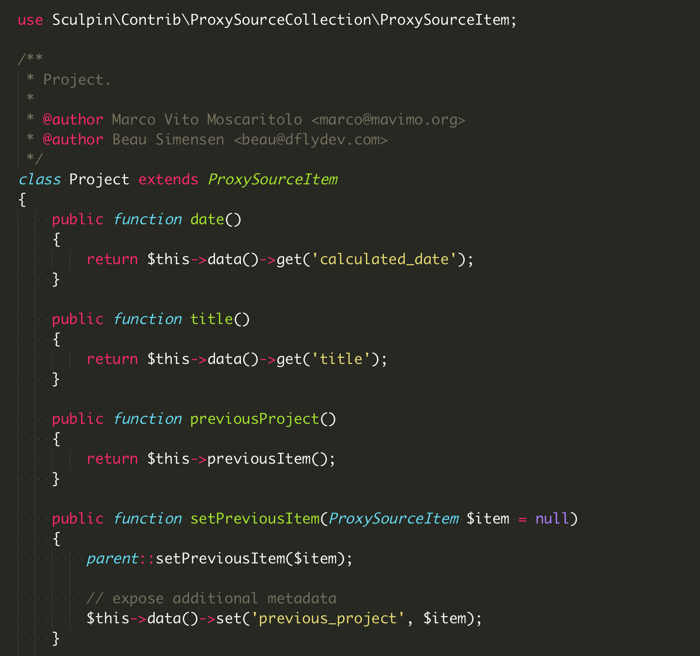
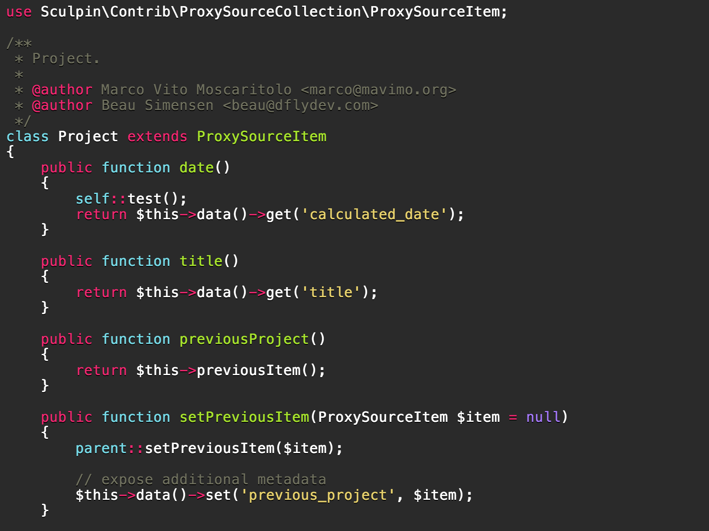

# Prism monokai PHP

Add [monokai theme](http://www.monokai.nl/blog/2006/07/15/textmate-color-theme/) to [PrismJS](http://prismjs.com) and better support for PHP language.

I use Sublime Text 3 as my default text editor and I love the Monokai theme that
is available. Some elements are not higlighted in Prism and is not possibile style
PHP code as visibile in ST3.

This package implements some new rules and override other to have better syntax
highlight and add monokai theme.

## Demo

Sublime Text 3:



Prism with prism-monokai-php:



## Usage

After include prism and other PHP language detection script, add also the ```prism-monokai-php.min.js```. This enable some new element higlight. To enable Monokai theme add also the ```prism-monokai-php.min.css```:

```html
  <script src="/mavimo/prism-monokai-php/dist/prism-monokai-php.min.js" />
  <link src="/mavimo/prism-monokai-php/dist/prism-monokai-php.min.css" />
```

## Development

Install dependencies using bower and npm:

```bash
  npm install
  bower install
```
change what do you need in src folder and use grunt to regenerate the output files:

```bash
  grunt
```
